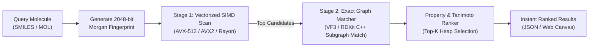

# MolIR

<div align="center">

### Molecular Information Retrieval Engine
*High-performance, structure-aware chemical search and discovery platform engineered in Rust with SIMD vectorization and cache-aligned memory mapping.*

[](https://www.rust-lang.org/)
[](https://en.wikipedia.org/wiki/Advanced_Vector_Extensions)
[](#license)
[](./architecture.md)
[](./roadmap.md)

</div>

---

## Overview

MolIR is an open-source chemical information retrieval engine designed to search, rank, and retrieve molecules across multimillion-compound datasets in sub-millisecond latencies. Inspired by enterprise platforms such as SciFinder and Reaxys, MolIR redesigns molecular search from the hardware level up.

Rather than relying on relational databases or generic text search indexes, MolIR treats molecular similarity as a high-throughput vectorized information retrieval problem. By combining 2048-bit packed Morgan (ECFP4) fingerprints, architecture-specific SIMD execution paths (AVX-512 / AVX2), work-stealing parallelism (Rayon), and zero-copy memory mapping (`mmap`), MolIR achieves high-efficiency chemical search at scale.



---

## Key Features

- **SIMD-Accelerated Hot Loops**: Hand-tuned vector kernels utilizing AVX-512 (`vpopcntdq`) and AVX2 (Harley-Seal vector trees) with safe scalar fallback for portable execution.
- **Zero-Copy Memory Mapping**: Instant startup time and minimal memory overhead by querying cache-aligned binary fingerprint blocks (`fingerprints.bin`) directly from disk via `memmap2`.
- **Rayon Work-Stealing Parallelism**: Lock-free chunked parallel query execution that dynamically scales with available CPU cores.
- **Two-Stage Retrieval Architecture**:
  - *Stage 1*: Fast SIMD bitwise candidate pruning over millions of fingerprints.
  - *Stage 2*: Exact chemical verification using C-ABI graph isomorphism matchers (VF3 / RDKit C++).
- **Multi-Parameter Physicochemical Filtering**: Compose structural similarity searches with physical property constraints (Molecular Weight, LogP, TPSA, HBD, HBA).
- **Modern API & Visual Interface**: Asynchronous Axum REST API, WebSocket live streaming, and interactive Ketcher 2D structure drawing canvas.

---

## System Architecture

```text
                       ┌───────────────────────────────┐
                       │    Web Canvas / Ketcher UI    │
                       └───────────────┬───────────────┘
                                       │ HTTP / WebSocket
                                       ▼
                       ┌───────────────────────────────┐
                       │     Axum REST / WS Gateway    │
                       └───────────────┬───────────────┘
                                       │
                                       ▼
                       ┌───────────────────────────────┐
                       │      Rust Search Core         │
                       │ ┌───────────────────────────┐ │
                       │ │  Rayon Work-Stealing Pool │ │
                       │ └─────────────┬─────────────┘ │
                       │               │               │
                       │   ┌───────────┴───────────┐   │
                       │   ▼                       ▼   │
                       │ AVX-512 / AVX2         Scalar │
                       │ Vector Kernels        Fallback│
                       └───────────────┬───────────────┘
                                       │
                                       ▼
                       ┌───────────────────────────────┐
                       │ Stage 2: Exact Graph Matcher  │
                       │ (VF3 / RDKit C++ via C-ABI)   │
                       └───────────────┬───────────────┘
                                       │
                                       ▼
                       ┌───────────────────────────────┐
                       │   Memory-Mapped Binary Data   │
                       │ (fingerprints.bin / metadata) │
                       └───────────────────────────────┘
```

For complete technical specifications, memory layouts, and sequence diagrams, refer to [architecture.md](./architecture.md).

---

## Repository Layout

```text
MolIR/
├── architecture.md       # Detailed technical design and memory specifications
├── roadmap.md            # Checkable milestone development roadmap
├── changelog.md          # Version history and release notes
├── CONTRIBUTING.md       # Contribution, code style, and benchmark guidelines
├── LICENSE               # Open source license (MIT / Apache-2.0)
│
├── core/                 # Core Rust search engine crate
│   ├── src/
│   │   ├── fingerprint/  # 2048-bit vector structures & Tanimoto math
│   │   ├── simd/         # AVX-512, AVX2, and Scalar search kernels
│   │   ├── storage/      # Binary layout, mmap reader, and manifest parser
│   │   ├── search/       # Rayon parallel scan & Top-K candidate heaps
│   │   ├── ranking/      # Property-aware multi-parameter ranking
│   │   └── ffi/          # C-ABI bridge to graph isomorphism matchers
│   └── Cargo.toml
│
├── api/                  # Asynchronous Axum HTTP & WebSocket service
│   ├── src/
│   └── Cargo.toml
│
├── cli/                  # Command-line search, inspection, and benchmark utility
│   ├── src/
│   └── Cargo.toml
│
├── native/               # Native C++ chemistry & graph matching libraries
│   ├── graph_matcher/    # VF3 / RDKit C++ subgraph isomorphism implementation
│   └── CMakeLists.txt
│
├── etl/                  # Offline chemical data ingestion & binary packer
│   ├── scripts/          # Python/RDKit dataset extraction and sanitization
│   └── requirements.txt
│
├── web/                  # Interactive Ketcher web UI application
│   ├── src/
│   └── package.json
│
└── benches/              # Criterion.rs throughput and SIMD benchmarks
    └── simd_benchmarks.rs
```

---

## Getting Started

### Prerequisites
- **Rust Toolchain**: 1.75+ (Nightly or Stable with `target-cpu=native`)
- **Python**: 3.10+ (for offline dataset ETL with RDKit)
- **C++ Compiler**: GCC 11+ / Clang 14+ / MSVC 2022 (with CMake 3.20+)
- **Node.js**: 18+ (for Web UI frontend)

### 1. Clone & Build
```bash
# Clone the repository
git clone https://github.com/your-username/MolIR.git
cd MolIR

# Build Rust workspace in release mode with native CPU vector extensions
RUSTFLAGS="-C target-cpu=native" cargo build --release
```

### 2. Prepare Sample Dataset (ETL)
```bash
# Setup Python environment
cd etl
python -m venv .venv
source .venv/bin/activate
pip install -r requirements.txt

# Ingest sample ChEMBL/PubChem dataset into binary packed format
python scripts/ingest.py --input sample_molecules.sdf --out-dir ../data/sample/
cd ..
```

### 3. Run Search Benchmarks
```bash
# Run Criterion benchmarks comparing Scalar vs AVX2 vs AVX-512
cargo bench
```

### 4. Start Local API Server
```bash
# Start Axum API server backed by mmap dataset
cargo run --release -p molir-api -- --dataset ./data/sample/manifest.json --port 8080
```

---

## API Reference Sample

### Similarity Search Request
`POST /api/v1/search/similarity`
```json
{
  "smiles": "CC(=O)Oc1ccccc1C(=O)O",
  "threshold": 0.75,
  "top_k": 50,
  "filters": {
    "molecular_weight": { "min": 150.0, "max": 400.0 },
    "logp": { "max": 3.0 }
  }
}
```

### Response Payload
```json
{
  "query": "CC(=O)Oc1ccccc1C(=O)O",
  "total_scanned": 10000000,
  "matched_count": 142,
  "elapsed_ms": 6.42,
  "results": [
    {
      "cid": 2244,
      "name": "Aspirin",
      "canonical_smiles": "CC(=O)Oc1ccccc1C(=O)O",
      "similarity": 1.0,
      "properties": {
        "molecular_weight": 180.16,
        "logp": 1.19,
        "tpsa": 63.6
      }
    }
  ]
}
```

---

## Roadmap & Milestones

Development is tracked through actionable checklists in [roadmap.md](./roadmap.md):
- [x] Initial Architecture & System Design
- [ ] Phase 0: Environment Setup & Chemical ETL Prototype
- [ ] Phase 1: Correctness-First Scalar Core & Reference Suite
- [ ] Phase 2: Packed Binary Storage & Zero-Copy `mmap`
- [ ] Phase 3: Parallel Query Engine (Rayon Work-Stealing)
- [ ] Phase 4: Vectorized SIMD Search Kernels (AVX2 / AVX-512)
- [ ] Phase 5: Candidate Buffering & Min-Heap Top-K Optimization
- [ ] Phase 6: Exact Substructure Search & FFI Graph Matcher
- [ ] Phase 7: Molecular Property Engine & Multi-Constraint Ranking
- [ ] Phase 8: High-Performance REST & Streaming WebSocket API
- [ ] Phase 9: Interactive Web UI & Ketcher Canvas Integration
- [ ] Phase 10: Chemical Knowledge Graph (Reactions & Literature)
- [ ] Phase 11: Production Hardening, Benchmarking & Sharding

---

## License

This project is licensed under either of:
- Apache License, Version 2.0 ([LICENSE-APACHE](http://www.apache.org/licenses/LICENSE-2.0))
- MIT license ([LICENSE-MIT](http://opensource.org/licenses/MIT))

at your option.
