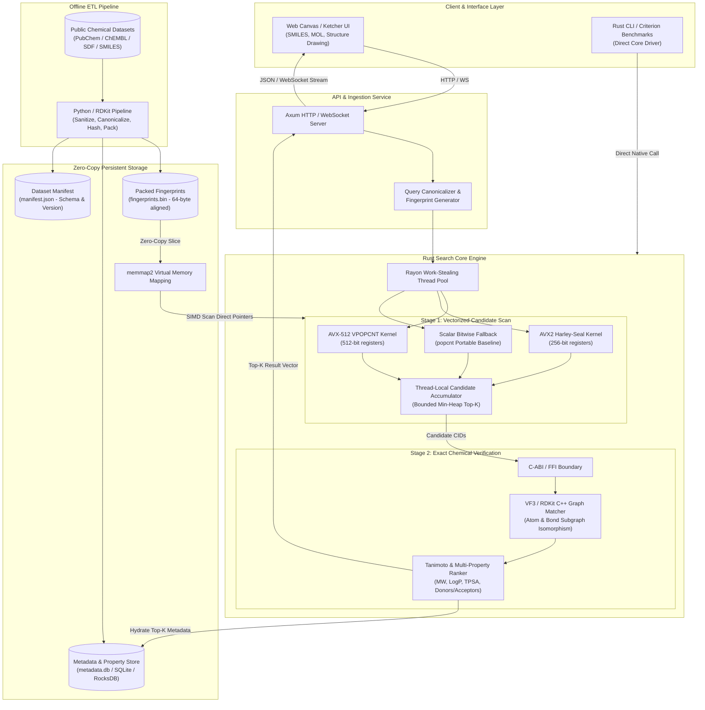
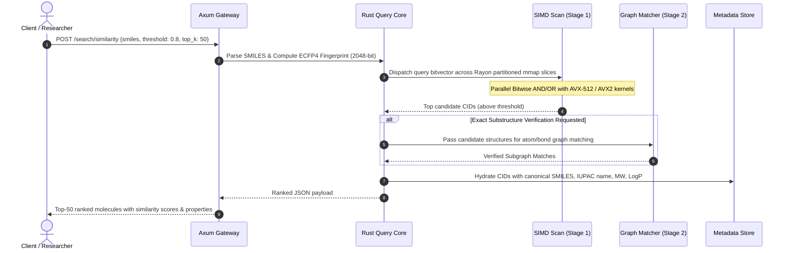
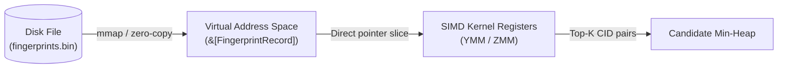
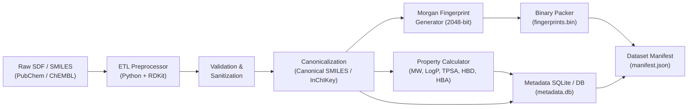

# MolIR System Architecture

> **Molecular Information Retrieval Engine**  
> High-performance, structure-aware chemical search and discovery platform engineered in Rust, SIMD vectorization, and cache-aligned memory mapping.

---

## 1. Executive Architectural Summary

**MolIR** treats chemical information retrieval as a **high-throughput vectorized information-retrieval problem**. Traditional relational or document databases struggle when evaluating molecular graph similarity (such as ECFP4/Morgan fingerprints over Tanimoto distances) across hundreds of millions of compounds. 

MolIR addresses this challenge by separating chemical computation into:
1. **Offline Ingestion / ETL**: Canonicalization, Morgan fingerprint extraction, molecular property pre-computation, and contiguous binary packing.
2. **Stage 1 (Vectorized Filtering)**: Work-stealing Rayon parallelism with AVX-512 / AVX2 SIMD bitwise popcount kernels scanning memory-mapped contiguous fingerprint blocks.
3. **Stage 2 (Exact Verification)**: C-ABI boundary calling graph-isomorphism engines (VF3 / RDKit C++) for atom/bond exact matches and substructure validation.
4. **Online Serving**: Thin Axum-based asynchronous API and interactive Ketcher-enabled Web frontend.

---

## 2. High-Level Architecture Diagram



---

## 3. Core Search Engine: Two-Stage Pipeline



### Stage 1: Vectorized Candidate Generation (SIMD & Rayon)
- **Goal**: Rapidly scan 10M-100M+ molecular fingerprints and discard non-matching structures with zero heap allocation per molecule.
- **Rayon Work Stealing**: The memory-mapped fingerprint buffer is partitioned into contiguous chunks (e.g., 8,192 or 16,384 fingerprints per work unit). Rayon balances CPU load across all physical cores.
- **SIMD Dispatch**: Dynamic runtime detection (`is_x86_feature_detected!`) routes execution to the fastest available instruction set:
  - **AVX-512** (`_mm512_popcnt_epi64` / `vpopcntdq`): 512-bit wide vector popcount across 8 words simultaneously.
  - **AVX2** (Harley-Seal vector popcount tree or `_mm256_popcnt_epi64` on AVX-512-VL): 256-bit wide SIMD vectorization.
  - **Scalar fallback** (`u64::count_ones` / `popcnt` instruction): Portable baseline for ARM, WebAssembly, and older x86 platforms.

### Stage 2: Exact Chemical Verification & Graph Matching
- **Goal**: Eliminate false positives arising from bit collisions or generalized path hashes during substructure / exact queries.
- **FFI Boundary**: Minimal, zero-overhead C ABI boundary calling graph isomorphism algorithms (such as **VF3** or RDKit C++ Subgraph Matcher).
- **Safety**: Only candidate molecule graphs passing Stage 1 are deserialized and evaluated, reducing expensive graph-isomorphism computations by 99.9%+.

---

## 4. Fingerprint Representation & Bitwise Mathematics

### 4.1 2048-Bit Morgan / ECFP4 Packing
Molecules are indexed using 2048-bit extended-connectivity fingerprints (ECFP4 equivalent, radius 2):

$$\text{Words} = \frac{2048 \text{ bits}}{64 \text{ bits/word}} = 32 \times \text{u64 words (256 bytes per molecule)}$$

```rust
#[repr(C, align(64))]
pub struct MolecularFingerprint {
    pub words: [u64; 32],
}
```

*Cache Alignment*: Aligning each record to a 64-byte boundary (CPU cache-line size) prevents cache-line straddling during sequential vectorized iteration.

### 4.2 Tanimoto (Jaccard) Similarity Metric
For binary fingerprints $A$ and $B$:

$$\text{Tanimoto}(A, B) = \frac{|A \cap B|}{|A \cup B|} = \frac{\sum_{i=0}^{31} \text{popcount}(A[i] \ \& \ B[i])}{\sum_{i=0}^{31} \text{popcount}(A[i] \ | \ B[i])}$$

Since $|A \cup B| = \text{popcount}(A) + \text{popcount}(B) - |A \cap B|$, the precomputed population count $\text{popcount}(B)$ can be stored or calculated on the fly:

$$\text{Tanimoto}(A, B) = \frac{|A \cap B|}{\text{popcount}(A) + \text{popcount}(B) - |A \cap B|}$$

---

## 5. Storage Layout & Zero-Copy Memory Mapping

### 5.1 Binary Storage (`fingerprints.bin`)
Contiguous, fixed-width layout allowing zero-deserialization direct pointer arithmetic:

```
Offset (Bytes)
0x00000000 ┌────────────────────────────────────────────────────────┐
           │ CID: 1 (u32) | Popcount: 42 (u16) | Reserved (10 bytes)│  Header: 16 bytes
           │ Words: [u64; 32] (256 bytes)                           │  Data:   256 bytes
0x00000110 ├────────────────────────────────────────────────────────┤
           │ CID: 2 (u32) | Popcount: 38 (u16) | Reserved (10 bytes)│
           │ Words: [u64; 32] (256 bytes)                           │
0x00000220 ├────────────────────────────────────────────────────────┤
           │ ...                                                    │
           └────────────────────────────────────────────────────────┘
```

Total size for 10 million molecules: $\approx 2.72 \text{ GB}$, comfortably fitting into system RAM or OS page cache via `mmap`.

### 5.2 Zero-Copy Data Flow



No heap allocations or serialization roundtrips occur within the hot search loop.

---

## 6. Offline ETL Pipeline Architecture



---

## 7. C-ABI / FFI Boundary Specification

To prevent fragile cross-language C++ object lifetimes, the FFI interface exchanges only POD (Plain Old Data) structs:

```c
/* C-ABI Header: molir_graph_matcher.h */
typedef struct {
    uint32_t cid;
    const char* mol_block;
    size_t mol_block_len;
} MolirCandidateMolecule;

typedef struct {
    uint32_t cid;
    bool is_match;
    float graph_score;
} MolirMatchResult;

// Pure function: no mutable state shared across boundary
int molir_verify_substructure(
    const char* query_smarts,
    const MolirCandidateMolecule* candidates,
    size_t candidate_count,
    MolirMatchResult* out_results
);
```

---

## 8. HTTP & WebSocket API Specification

### 8.1 REST Endpoints

| Endpoint | Method | Description |
|---|---|---|
| `/api/v1/search/similarity` | `POST` | Execute vectorized fingerprint similarity query (Top-K / Threshold). |
| `/api/v1/search/exact` | `POST` | Fast canonical hash lookup for exact chemical identity. |
| `/api/v1/search/substructure` | `POST` | Two-stage candidate filter + subgraph isomorphism search. |
| `/api/v1/molecule/:cid` | `GET` | Retrieve full chemical record (SMILES, InChIKey, 2D coordinates, properties). |
| `/api/v1/system/status` | `GET` | Return engine health, dataset version, loaded molecules, and active SIMD backend. |

### 8.2 Streaming WebSocket Endpoint
- `WS /api/v1/search/stream`: Allows client to stream partial Top-K results in real-time as chunks complete scanning, providing instant visual feedback in web UI.

---

## 9. Performance & Scalability Targets

| Metric | Target | Verification Method |
|---|---|---|
| **Scan Throughput (Single Core)** | > 50M fingerprints / second | Criterion benchmark (`benches/simd.rs`) |
| **Scan Throughput (32 Cores AVX-512)** | > 1.2B fingerprints / second | Multi-threaded Rayon throughput test |
| **Query Latency (10M DB, Top-50)** | < 15 ms (P99) | End-to-end load testing (`wrk` / `k6`) |
| **Memory Overhead** | < 10% above raw binary file size | Memory profiling with Valgrind / Heaptrack |
| **Startup Time** | < 100 ms (via `mmap`) | Cold vs warm boot timing |

---

## 10. Future Extension: Chemical Knowledge Graph

Following the core similarity engine, the retrieval engine will expand to index:
1. **Reaction Search**: Reactants, products, catalysts, reaction roles, and yield predictions.
2. **Literature & Patent Mining**: Automated extraction and mapping of compound CIDs to DOI publications and USPTO/EPO patent filings.
3. **Natural Language Chemical IR**: Embedding-based hybrid search combining dense semantic vectors with sparse Morgan structural fingerprints.
